# Comfort Descriptor Table

The full mapping from **temperature + dew point** to a **word** and an **icon**.
The icon has two renditions: the color **emoji** shown in the app, and the
**SF Symbol** shown in tinted watch-face complications.

This file is the human-readable companion to the source of truth in code
([`ComfortDescriptor.swift`](Sources/ThermalComfort/ComfortDescriptor.swift) for
the word→icon catalog, [`Describe.swift`](Sources/ThermalComfort/Describe.swift)
for the banding) and the [thermal-comfort spec](thermal-comfort-spec.md). It is
meant to be **updated as we get real-world "felt right / felt off" feedback** —
when a band feels wrong on-device, adjust it here and in code together.

> The complication glyphs below are rendered to PNGs by
> [`Scripts/render-symbols.swift`](Scripts/render-symbols.swift) (`just symbols`).
> They are drawn white on a dark square to mimic a watch face and to read on both
> light and dark themes — the **actual tint varies with the user's watch-face
> settings**, so review the glyph choice, not the exact color.

> Notes on inputs:
> - Dew point is clamped to ≤ temperature.
> - **RH** = relative humidity (Magnus formula); some bands switch on RH rather
>   than raw dew point because the same dew point reads very differently across a
>   temperature range.
> - **Feels** = feels-like (heat index when valid, i.e. temp ≥ 80 °F and RH ≥ 40 %;
>   otherwise the actual temperature).
> - Range below −30 °F and above 130 °F is not handled.

## Bitter / Freezing — temp < 32 °F

| Temp (°F) | Condition | Word | Emoji | Complication symbol |
|---|---|---|---|---|
| < 20 | any | Bitter | 🥶 | 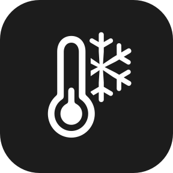 `thermometer.snowflake` |
| 20–31 | RH > 85 | Raw | 🌫️ | 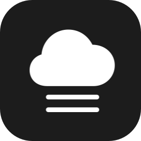 `cloud.fog.fill` |
| 20–31 | RH ≤ 85 | Freezing | ❄️ | 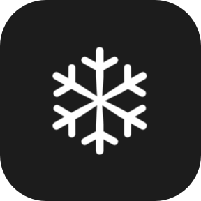 `snowflake` |

## Cold — 32–49 °F

| Condition | Word | Emoji | Complication symbol |
|---|---|---|---|
| RH > 85 | Raw | 🌫️ |  `cloud.fog.fill` |
| dp < temp − 15 | Crisp | 🍃 |  `leaf.fill` |
| otherwise | Cold | 🧥 | 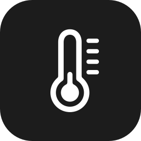 `thermometer.low` |

## Cool — 50–64 °F (RH-driven)

| Condition | Word | Emoji | Complication symbol |
|---|---|---|---|
| RH > 88 | Clammy | 🌫️ | 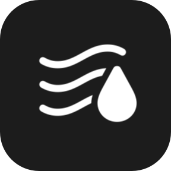 `humidity.fill` |
| dp < 38 | Crisp | 🍃 |  `leaf.fill` |
| dp < 50 | Brisk | 💨 |  `wind` |
| RH < 80 | Comfortable | 🌤️ | 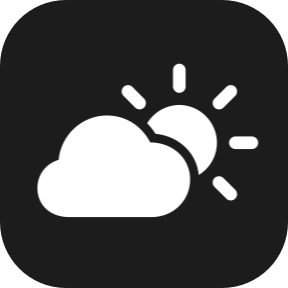 `cloud.sun.fill` |
| otherwise | Damp | 💧 | 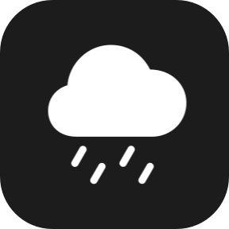 `cloud.drizzle.fill` |

## Mild — 65–74 °F (dew-point-driven, capped at Muggy)

| Dew point (°F) | Word | Emoji | Complication symbol |
|---|---|---|---|
| < 50 | Pleasant | ☀️ |  `sun.min.fill` |
| 50–56 | Comfortable | 🌤️ |  `cloud.sun.fill` |
| 57–62 | Sticky | 💦 | 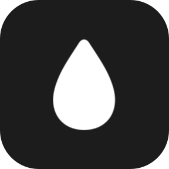 `drop.fill` |
| 63+ | Muggy | 😓 | 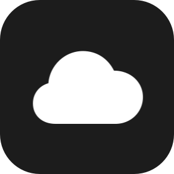 `cloud.fill` |

## Warm — 75–79 °F (dew-point-driven)

| Dew point (°F) | Word | Emoji | Complication symbol |
|---|---|---|---|
| < 48 | Balmy | 🌞 | 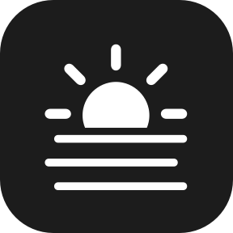 `sun.haze.fill` |
| 48–56 | Warm | ☀️ | 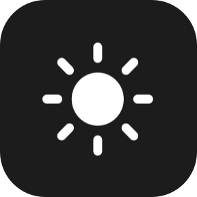 `sun.max.fill` |
| 57–62 | Sticky | 💦 |  `drop.fill` |
| 63–69 | Muggy | 😓 |  `cloud.fill` |
| 70+ | Oppressive | 😰 | 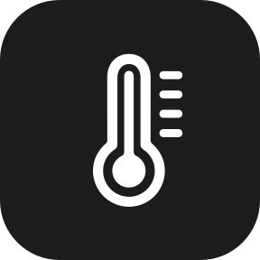 `thermometer.high` |

## Hot — 80–89 °F (feels-like-driven)

| Feels (°F) | Dew point (°F) | Word | Emoji | Complication symbol |
|---|---|---|---|---|
| < 84 | any | Warm | 🌞 |  `sun.max.fill` |
| 84–89 | < 62 | Hot | 🌡️ | 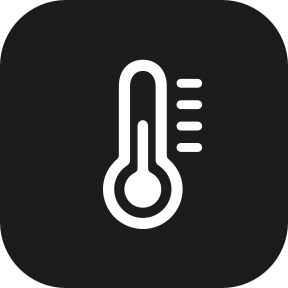 `thermometer.medium` |
| 84–89 | 62–67 | Muggy | 😓 |  `cloud.fill` |
| 84–89 | 68+ | Oppressive | 😰 |  `thermometer.high` |
| 90–96 | < 60 | Sweltering | 🔥 | 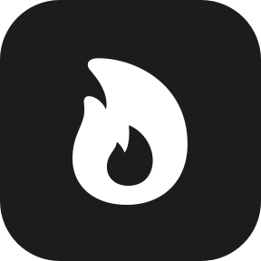 `flame.fill` |
| 90–96 | 60–67 | Oppressive | 😰 |  `thermometer.high` |
| 90–96 | 68+ | Miserable | 😵 | 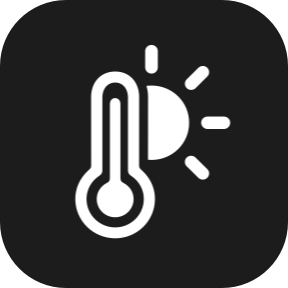 `thermometer.sun.fill` |
| 97+ | any | Miserable | 😵 |  `thermometer.sun.fill` |

## Very Hot — 90–99 °F (dew-point-driven)

| Dew point (°F) | Word | Emoji | Complication symbol |
|---|---|---|---|
| < 45 | Dry Heat | 🌵 | 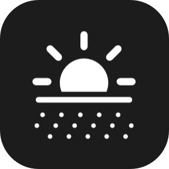 `sun.dust.fill` |
| 45–54 | Hot | 🌡️ |  `thermometer.medium` |
| 55–62 | Sweltering | 🔥 |  `flame.fill` |
| 63–67 | Miserable | 😵 |  `thermometer.sun.fill` |
| 68+ | Dangerous | 🥵 | 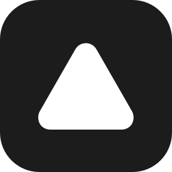 `exclamationmark.triangle.fill` |

## Extreme — 100 °F+ (dew-point-driven)

| Dew point (°F) | Word | Emoji | Complication symbol |
|---|---|---|---|
| < 48 | Scorching | 🏜️ | 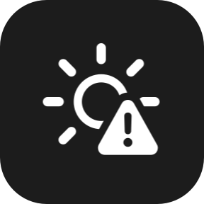 `sun.max.trianglebadge.exclamationmark` |
| 48–59 | Dangerous | 🥵 |  `exclamationmark.triangle.fill` |
| 60+ | Deadly | ☠️ | 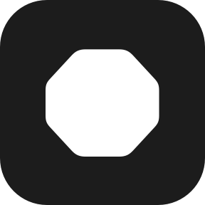 `exclamationmark.octagon.fill` |

---

### Known judgment calls

- **Boundary thresholds** (e.g. dp 62 / 68 / 70, the RH cutoffs) were tuned by
  feel, not derived from a single published standard — prime candidates for
  retuning from feedback.
- **"Warm" uses two emoji** — ☀️ in the 75–79 °F band, 🌞 in the 80–89 °F band
  (and Pleasant also uses ☀️). Both share the `sun.max.fill` symbol. Flagged as a
  likely inconsistency to resolve during tuning.
